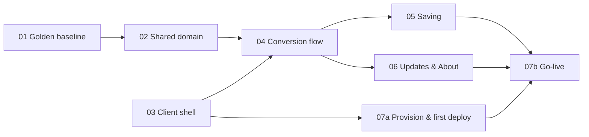

# 00 — Overview: building the offline PWA

The step-by-step plan for building **`Kroiko.Client.Blazor`**: a standalone, offline-capable,
installable Blazor WebAssembly PWA that runs the whole conversion in the browser. Upload a
Polyboard file → parse → review and edit per manufacturer (Lonira / Suliver / MegaTrading) →
generate `.xlsx` + `.cut_mt` → save locally. There is no backend, no login, no credits and no email.
`ATAFurniture.Server` stays deployed and behaves exactly as it does today.

The **why** lives in the ADRs ([docs/adr/](../adr/README.md)). These guides give the **how** and
the **order**, and never restate a decision. The plan was charted in the map
[Offline installable Blazor WASM PWA (no backend)](https://github.com/PavelRPavlov/Kroiko/issues/15);
the phase cut was decided in
[Phases and order of the PWA implementation guides](https://github.com/PavelRPavlov/Kroiko/issues/31).

## Phases

| # | Guide | Proves / delivers | ADRs | Status |
|---|---|---|---|---|
| 01 | [Golden baseline](01-golden-baseline.md) | Today's Server output recorded as golden files | [0004](../adr/0004-shared-browser-safe-conversion-domain.md), [0007](../adr/0007-parity-and-test-strategy.md) | Not started |
| 02 | [Shared domain](02-shared-domain.md) | The whole pipeline in a browser-safe `Kroiko.Domain`; the Server rewired onto it, with identical output | [0004](../adr/0004-shared-browser-safe-conversion-domain.md), [0006](../adr/0006-known-conversion-bugs-in-pwa.md), [0007](../adr/0007-parity-and-test-strategy.md), [0008](../adr/0008-upgrade-largexlsx-to-2.md) | Not started |
| 03 | [Client shell](03-client-shell.md) | A MudBlazor app shell that starts offline, plus the Playwright harness | [0005](../adr/0005-copy-conversion-ui-into-pwa.md), [0007](../adr/0007-parity-and-test-strategy.md) | Not started |
| 04 | [Conversion flow](04-conversion-flow.md) | `ConverterState`, the copied UI, "Изтегли всички"; parity proven in a trimmed build under `bg-BG` | [0005](../adr/0005-copy-conversion-ui-into-pwa.md), [0006](../adr/0006-known-conversion-bugs-in-pwa.md), [0003](../adr/0003-save-order-files-to-picked-folder.md) §5, §7, §8, [0002](../adr/0002-pwa-updates-reload-prompt.md) §7, [0007](../adr/0007-parity-and-test-strategy.md) | Not started |
| 05 | [Saving](05-saving.md) | "Запази в папка…", per-file downloads, ` (n)` clash naming | [0003](../adr/0003-save-order-files-to-picked-folder.md) | Not started |
| 06 | [Updates & About](06-updates-and-about.md) | Reload snackbar, update checks, version in About | [0002](../adr/0002-pwa-updates-reload-prompt.md) | Not started |
| 07 | [Hosting & go-live](07-hosting-and-go-live.md) | 07a: SWA + first manual deploy of the shell; 07b: release checklist, go-live sign-off | [0001](../adr/0001-host-pwa-on-azure-static-web-apps.md), [0007](../adr/0007-parity-and-test-strategy.md) §9 | Not started |

The **Status** column mirrors each guide's own `Status:` line. The guide is the source of truth;
update both in the same PR.

## Order and parallel lanes

- **Lane A:** `01 → 02`. **Lane B:** `03` runs alongside lane A, because the shell does not touch `Kroiko.Domain`.
- `04` needs **both** `02` and `03`.
- `05` and `06` run alongside each other after `04`. They touch different code (the file list and
  save interop versus the service worker, app bar and About), and the unsaved-work flag they share
  already exists after `04`.
- `07a` may start as soon as `03` is **Done**, deploying the shell manually to the `main`
  staging environment. `07b` needs `05`, `06` and `07a`.

## How to work a step

1. Pick the first step that is not done in a guide that is not **Done** and whose dependencies are
   **Done**. Check the tracker, because another session may be working in parallel.
2. **One step = one PR** on a feature branch against `main` (see [AGENTS.md](../../AGENTS.md)).
   Each step is independently green. The first step's PR sets the guide to `Status: In progress`,
   and the PR that ticks the last done criterion sets it to `Status: Done`. Update the table above
   in the same PR.
3. Tick the guide's done-criteria boxes in the PR that makes them true.
4. If a step turns out to need a decision that no ADR covers, stop and record it as a new ADR
   (or ask) — don't improvise architecture inside a step.

## Rules for every phase

- **Tests before PR.** Any change to `Kroiko.Client.Blazor` or `Kroiko.Domain` runs the **full**
  `dotnet test` (including E2E, once it exists) before its PR, and the PR body says so
  ([ADR-0007](../adr/0007-parity-and-test-strategy.md) §6). `dotnet test --filter Category!=E2E`
  is the fast inner loop.
- **Golden diffs are decisions.** A PR that changes a file under `Kroiko.Testing/TestData/golden/`
  (or its phase-01 location) must say why. Only [ADR-0008](../adr/0008-upgrade-largexlsx-to-2.md)
  is planned to change golden files.
- **Intended differences.** A new PWA-vs-Server difference needs an ADR, a row in
  [CONTEXT.md §9](../../CONTEXT.md) and a test, all in the same PR (ADR-0007 §7).
- **Invariants.** `CultureInfo.InvariantCulture` for every number↔string conversion in the domain;
  `Kroiko.Domain` stays browser-safe; nothing secret in the client; MudBlazor only (never Syncfusion
  or Radzen); the Bulgarian UI text is kept as the Server has it.
- **The Server is maintained, not developed.** Change `ATAFurniture.Server` only where phase 02
  rewires it onto the domain.
- **Synthetic fixtures only.** Never commit a real customer Polyboard export (ADR-0007 §3).

## Not in these guides

- **CI/CD.** Deploys are manual through `scripts/publish-pwa.ps1` (phase 07), which enforces
  ADR-0001's branch model. A CI workflow is a later improvement outside this plan.
- Anything that changes, retires or decommissions `ATAFurniture.Server` or its Azure resources.
- Email or share-sheet sending, licensing or credits, OS file handlers (`file_handlers`).
